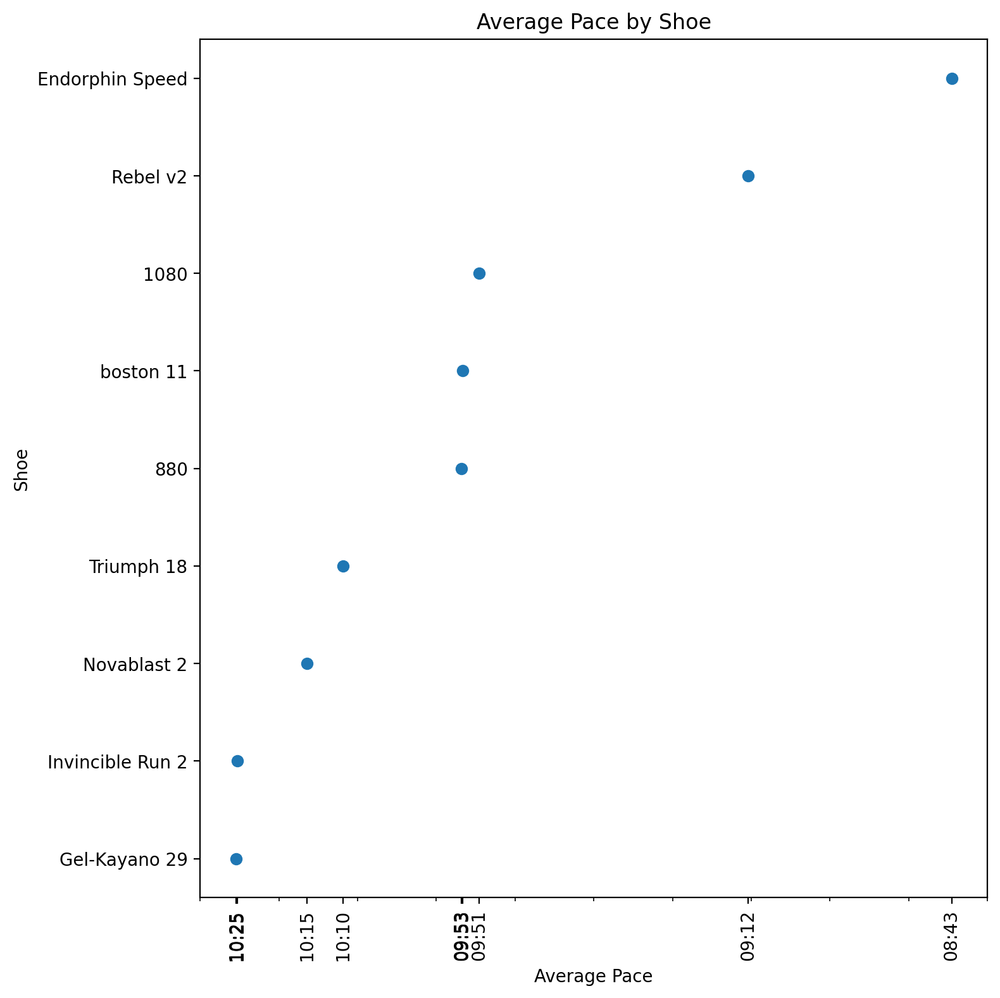
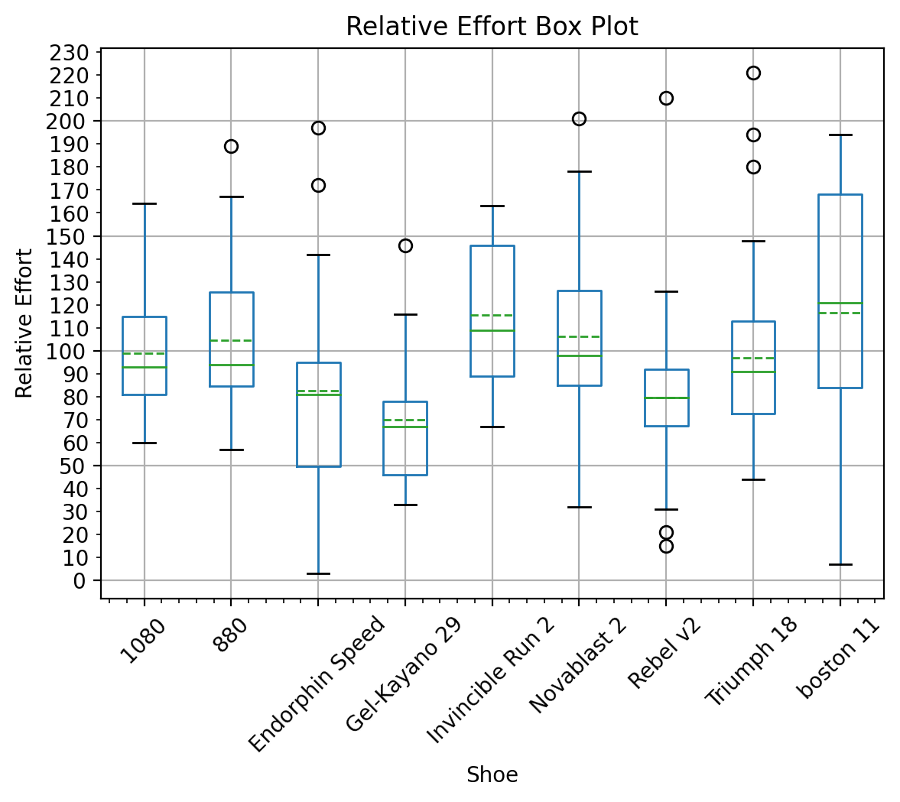
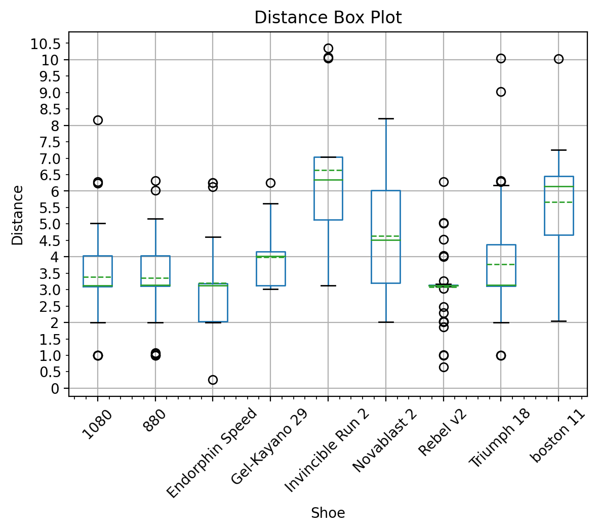
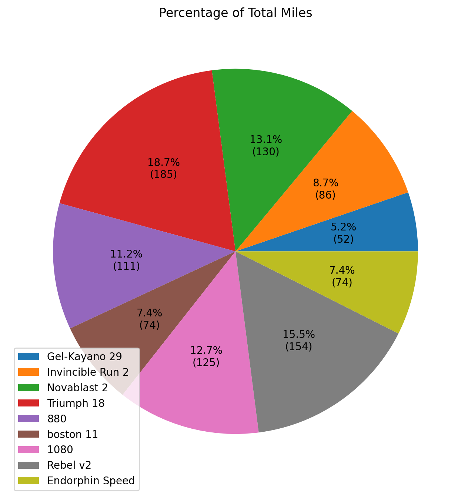
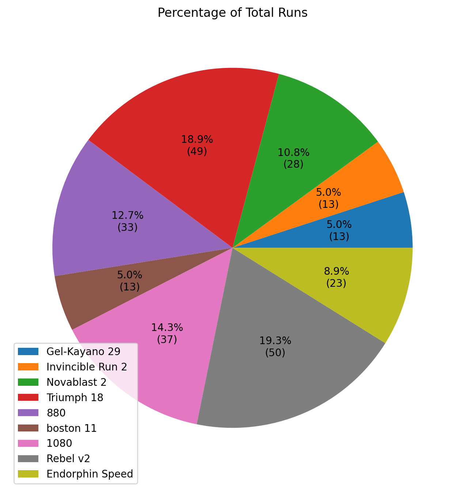

# Strava Shoe Explorer

This is a simple Python program for reading activity data from the Strava API, grouping those activities by the gear
used during the activity and making some simple visualizations about that gear. This program is designed to create visualizations using
data from running activities, and it assumes the type of gear used are running shoes. I am sure it could be repurposed for any supported
exercise and gear types, but, in its current state, that is not its scope.

In order to run this program, you'll need: 

- A Strava account.
- At least one activity recorded on that Strava account and one saved piece of gear associated with that activity. 
- A personal API application on that Strava account. 
  - and the corresponding `client_id`, `client_secret` and `refresh_token` for that API application.

Below instructions are provided for creating a personal API application and retrieving the necessary values to run this program. 
Please note that, in the settings for your personal API application, you will find a refresh token; however, that is not a substitute
for the steps below describing how to retrieve a refresh token for use by this program. The token provided in the settings page for your personal application
only has read access, and this program requires a token with read all access.

## How to get client_id and client_secret

- Create an API Application on Strava at [https://www.strava.com/settings/api ](https://www.strava.com/settings/api) and
  set the Authorization Callback Domain to localhost
- Navigate back to [https://www.strava.com/settings/api ](https://www.strava.com/settings/api) and you should see Client
  ID, Client Secret, Your Access Token, and Your Refresh Token

## How to request a refresh_token

- Replace the values in the following template with the appropriate values from your API application's settings page and navigate to the URL in a browser: `https://www.strava.com/oauth/authorize?client_id=[your_client_id]&response_type=code&redirect_uri=http://localhost/exchange_token&approval_prompt=force&scope=activity:read_all`
- Copy the code provided in the URL after authorizing your app. The URL should look like
  this: `http://localhost/exchange_token?state=&code=[CODE]&scope=read,activity:read_all`
- Make the following GET request either from the commandline or a GUI like Postman or HTTPie:

````
curl --request POST \
  --url 'https://www.strava.com/oauth/token?client_id=[your_client_id]&client_secret=[your_client_secret]&code=[CODE]&grant_type=authorization_code'
````

- Your refresh token will be in the response as `"refresh_token"`

## Image Examples 










